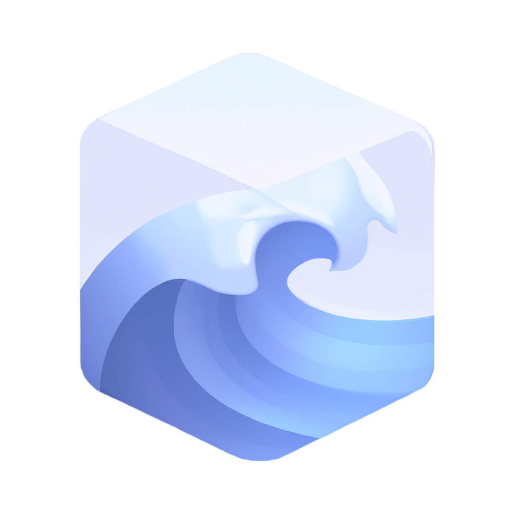
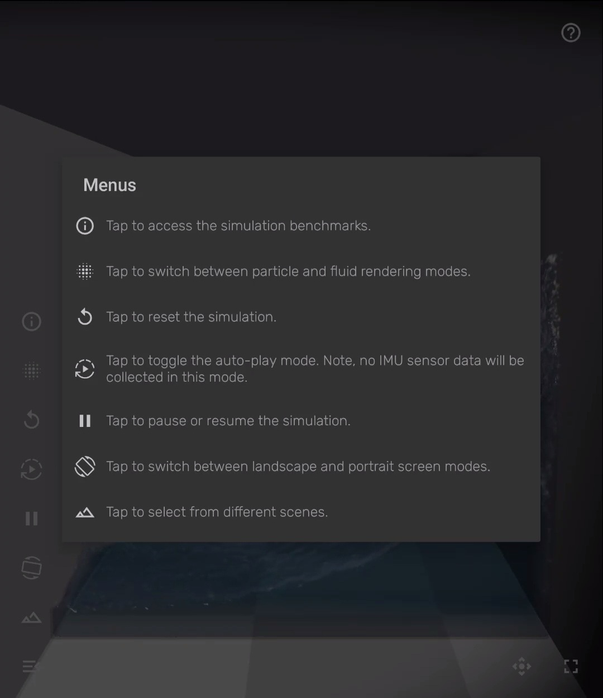
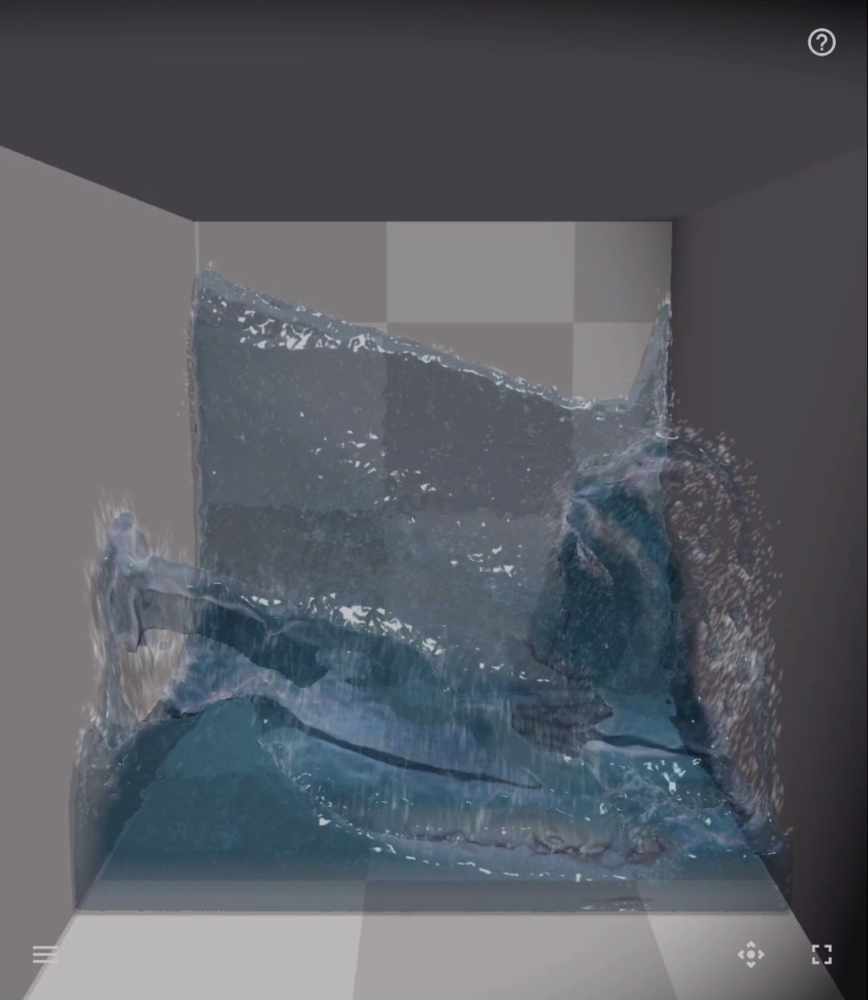
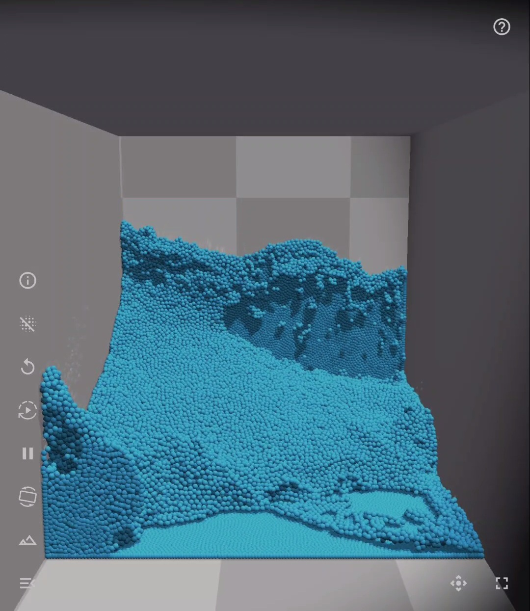

#  OpenFluid: Real-Time Fluid Simulation 
OpenFluid utilizes Gabriel, a platform designed for wearable cognitive assistance applications, to dynamically adjust fluid simulations in real-time on the server using acceleration sensor data from a mobile device. The simulation frames are then streamed to the device, enabling interactive 3D fluid simulations on mobile platforms.


  


Demo on Samsung Galaxy Fold 4

!!UPDATE!!
Copyright &copy; 2017-2019 
Carnegie Mellon University

This is a developing project.

## License
Unless otherwise stated, all source code and documentation are under the [Apache License, Version 2.0](http://www.apache.org/licenses/LICENSE-2.0.html).
A copy of this license is reproduced in the [LICENSE](LICENSE) file.

Parts of this repository include modified content from third-party sources. Files located in `server/FleX` are copyrighted by their respective authors and are subject to the licenses mentioned. Please refer to `server/FleX/README.md` for any additional copyright information for the codes used in the third-party source.

Project | Modified | License
---|---|---|
[NVIDIAGameWorks/FleX](https://github.com/NVIDIAGameWorks/FleX) | Yes | Nvidia Source Code License (1-Way Commercial)

## Prerequisites

OpenFluid server has been tested on __Ubuntu 22.04 LTS (Jammy Jellyfish)__ using several nVidia GPUs ( Quadro P1000, GTX 1080 Ti, Tesla V100).

Based on our test, the most stable version (compatible with most of the Nvidia GPUs) is when you have:
1. Ubuntu 22.04
2. installed nvidia-driver-535 (535.86.10)
3. using docker version 'test-driver535'

OpenFluid supports Android Client. We have tested the Android client on __Nexus 6__, __Samsung Galaxy Z Fold 4__, and __Essential PH-1__.

## Server Installation using Docker

Easily set up an OpenFluid server by deploying our pre-configured Docker container. This build has been optimized for NVIDIA GPUs (still need to check compatibility with the RTX GPUs). Ensure you have root access to execute the following steps. We've validated these instructions using Docker version 24.0.5.

### Step 1. Install Docker

If Docker isn't already on your system, you can follow [this Docker install guide](https://docs.docker.com/engine/installation/linux/docker-ce/ubuntu/). Alternatively, use the convenience script below:

```sh
curl -fsSL get.docker.com -o get-docker.sh
sh get-docker.sh
```

### Step 2. Install NVIDIA CUDA drivers version 535

Visit [the NVIDIA CUDA downloads page](https://www.nvidia.com/Download/Find.aspx?lang=en-us) to select your operating system and receive step-by-step installation guidance. __It is important that you get the version 535.86.10 for your driver.__

For Debian-based Linux distributions, you can use the following command:
```bash
sudo apt-get update && apt-get install -y nvidia-driver-535
```

To verify an existing NVIDIA driver installation, execute `nvidia-smi`. The installed driver version will be displayed at the top of the output.

### Step 3. Set Up the [NVIDIA Container Toolkit](https://github.com/NVIDIA/nvidia-docker)

This toolkit is essential for NVIDIA GPU support. Follow [this instructions guide](https://docs.nvidia.com/datacenter/cloud-native/container-toolkit/install-guide.html#installing-on-ubuntu-and-debian) or use the command below:

```bash
sudo apt-get update \
    && sudo apt-get install -y nvidia-container-toolkit-base
```

### Step 4. Download the OpenFluid Docker Image
Fetch the Docker image using:
```bash
docker pull ghcr.io/cmusatya/openfluid:version1.0
```
Or, if you're in the project's root directory:
```bash
make docker-pull
```

### Step 5. Launch the Docker container
Execute:
```bash
docker run --gpus all --rm -it -p 9099:9099 ghcr.io/cmusatya/openfluid:version1.0
```

Alternatively, from the project root:
```bash
make docker-git-run
```
## Running server on Amazon AWS

If you wish to compare between running the server on a cloudlet versus a cloud instance, you can launch the following instance type/image from your Amazon EC2 Dashboard:

__Instance Type__ - p2.xlarge (can be found by filtering under GPU compute instance types)

__Image__ - Deep Learning Base AMI (Ubuntu) - ami-041db87c

__Ensure that port 9099 is open in your security group rules so that traffic to/from the mobile client will pass through to the server.__

Once the server is running in AWS, you can follow the steps above to setup the server.

__Note__ : If using vanilla Ubuntu Server 16.04 Image, install the required Nvidia driver (version 470) and reboot.

<!-- UPDATE::
```bash
wget http://us.download.nvidia.com/tesla/375.51/nvidia-driver-local-repo-ubuntu1604_375.51-1_amd64.deb
sudo dpkg -i nvidia-driver-local-repo-ubuntu1604_375.51-1_amd64.deb
sudo apt-get update
sudo apt-get -y install cuda-drivers
sudo reboot
``` -->

## Running server on Microsoft Azure

If you wish to compare between running the server on a cloudlet versus a cloud instance, you can launch the following VM from your Azure portal:

__Size__ - Select NC4as_T4_v3

__Image__ - NVIDIA GPU-Optimized VMI with vGPU driver

__Network Setting__ - Make sure to open port `9099` in your Inbound port rules. This ensures that traffic from/to the mobile client will be directed to the server.

__Extensions__ NvidiaGpuDriverLinux

After successfully setting up the VM:

1. Run the following command to update and downgrade the NVIDIA driver:
```bash
sudo apt-get update && apt-get install -y nvidia-driver-470-server
```
2. Proceed from step 4 of `Server Installation using Docker`. Note: Instead of using the version1.0 docker image as mentioned in previous steps, utilize the test-driver470 image. 


## Compiling the Source Code

### Option A. Using Docker Environment
We've provided a Docker image equipped with all necessary dependencies, enabling you to compile and run the server directly from the source within the given environment. 

#### A.1 Fetch the Docker Image
```bash
docker pull ghcr.io/cmusatya/openfluid:env
```
Alternatively, from the project root:
```bash
make docker-env-pull
```

#### A.2 Download Cuda-9.2 Toolkit
OpenFluid employs the Flex SDK, a GPU-centric particle simulation library, which mandates the CUDA 9.2.148 toolkit for compilation. Download the [cuda toolkit 9.2](https://developer.nvidia.com/cuda-92-download-archive), and position the acquired `/usr/local/cuda-9.2` in `project_root/server/cuda-9.2`.


#### A.3 Launch the Docker Image
From the project root:
```bash
docker run --gpus all -it -p 9099:9099 --rm --name=openfluid-env --mount type=bind,source=${PWD}/server,target=/server ghcr.io/cmusatya/openfluid:env

```
Or:
```bash
make docker-env-git-run
```


### Option B. Local Environment
Set up required libraries on your machine.

#### B.1 Set Up CUDA
OpenFluid employs the Flex SDK, a GPU-centric particle simulation library, which mandates the CUDA 9.2.148 toolkit for compilation. Download the [cuda toolkit 9.2](https://developer.nvidia.com/cuda-92-download-archive), and position the acquired `/usr/local/cuda-9.2` in `project_root/server/cuda-9.2`.

For the CUDA runtime library and driver, visit [the NVIDIA CUDA downloads page](https://www.nvidia.com/Download/Find.aspx?lang=en-us) to select your operating system and receive step-by-step installation guidance. __It is important that you get the version 535.86.10 for your driver.__

To verify your NVIDIA driver, use `nvidia-smi`. The driver version appears at the top of the resulting output.

Ensure you've set the path for the CUDA runtime libraries, for instance, in your `.bashrc`:
```bash
export LD_LIBRARY_PATH=$LD_LIBRARY_PATH:/usr/local/cuda/lib64
```

#### B.2 Install Remaining Dependencies
OpenFluid relies on freeGLUT and EGL for headless fluid scene rendering, zeroMQ for IPCs, protobuf for packet serialization, and JPEG for image frame compression.

```bash
sudo apt-get -y install \
    libzmq3-dev \
    protobuf-compiler libprotobuf-dev \
    libegl1-mesa-dev libgl1-mesa-dev \
    freeglut3-dev \
    libjpeg-dev \
    software-properties-common
```

Match the OpenGL library version to your NVIDIA Driver (use `nvidia-smi` for version checking):

```bash
sudo apt-get -y install libnvidia-gl-535  
```

A portion of the server is Python-based. __Ensure you use Python 3.8__

```bash
sudo add-apt-repository ppa:deadsnakes/ppa && apt-get update && apt-get install -y \
    python3.8 \
    python3.8-dev \
    python3-pip \
 && apt-get install -y --reinstall python3.8-distutils \
 && python3.8 -m pip install --upgrade pip \
 && python3.8 -m pip install --no-cache-dir \
    -r server/requirements.txt
```

### Compilation & Execution
Navigate to `/server` and execute:
```bash
make release && make run

```


## Android Client

You can download the client from the [Google Play Store](https://play.google.com/store/apps/details?id=edu.cmu.cs.openrtist), or install openfluid-v1.0.apk in this repo. UPDATE

Alternatively, build the client using [Android Studio](https://developer.android.com/studio). The source code for the client is located in the `android-client` directory. You should use the standardDebug [build variant](https://developer.android.com/studio/run#changing-variant).

### Server Management

Servers can be added by pressing the + sign button, then entering a server name and address. Selecting a server connects to the corresponding OpenFluid server. Swipe left or right to remove a server from the list.

### Fluid Simulation
  
  


Post connection, the application showcases a simulation scene. Fluid motion is influenced by the mobile device's acceleration sensor. Various scene manipulation options are available. For guidance, tap the "?" icon at the top right.

The interface offers modes like camera view adjustments, full-screen mode, screen orientation changes, simulation pausing/resuming, scene or liquid type switching, auto-sensor input generation, and rendering style toggling (particle/liquid). 


### Settings

##### General

* __Image Resolution__: Adjust the frame resolution. Higher resolutions might reduce FPS and increase latency.
* __Gabriel Token Limit__: Allows configuration of the token-based flow control mechanism in the Gabriel platform. This indicates how many frames can be in flight before a response frame is received back from the server. The minimum of the token limit specified in the app and the number of tokens specified on the server will be used. With a stable network, "No limit" yields the highest FPS.

##### UI
* __Set FPS Limit (Vsync)__: Enables the server to cap the maximum simulation fps. If disabled, there's no FPS limit.
* __Target FPS (Vsync) Limit__: When `Set FPS Limit` is true, set the desired limit for the FPS (60, 90, or 120)
* __Autoplay Sequence Interval__:  Switch the interval between the auto-generate sensor input from changing. 

## Using the MakeFile/Dockerfile

### Building the server-app docker image:
Download cuda toolkit 9.2 from the link bellow, and place the /usr/local/cuda-9.2 in server/cuda-9.2 first
https://developer.nvidia.com/cuda-92-download-archive
```
make docker-build [version] [username] 
```
--> username is github username (prob cmusatyalab)


### Running the local docker image
```
make docker-run [version] [username] 
```

### Pushing docker image to the github container registry
```
make docker-push <image-id> [version] [username] 
```
--> check the image-id by "docker image list" and see the IMAGE ID column

### Pulling docker image from the github container registry
```
make docker-pull [version] [username] 
```

### Running the image pulled from the github container registry
```
make docker-git-run [version] [username] 
```

### Building the development environment image
```
make docker-env-build [username]
```

### Running the local environment image
```
make docker-env-run [username] 
```

### Pushing, pulling environment image
use docker-push with "env" for the version name

### Running the image pulled from the github container registry
```
make docker-env-git-run [username]  
```


## Protocol

The Extras proto is defined in `android-client/app/src/main/proto/openfluid.proto` and `server/Flex/demo/proto`.

As you make changes to this proto, make sure they are identical. After making changes, it will be recompiled for the android client the next time you start the Android client from Android Studio. Do following command in `/server` directory to recompile proto file for the server. 
```
make protoc 
```

## Troubleshooting
### ERROR: eglGetDisplay() failed! eglGetError() = 0x3001
### Flex: Could not open CUDA driver, ensure you have the latest driver (nvcuda.dll) installed and an NVIDIA GPU present on the system
If you encounter the error message above while running the server, try following the steps below based on the option you chose for server installation:

### Option 1: Server Installation using Docker
1. Install Nvidia-drive-470, instead of version 535:

e.g. if you are using Ubuntu:
```bash
sudo apt-get update && apt-get install -y nvidia-driver-470
```

2. Use the docker image test-driver470:
```bash
docker pull ghcr.io/cmusatya/openfluid:test-driver470
```

3. Run the docker container:
``` bash
docker run --gpus all --rm -it -p 9099:9099 ghcr.io/cmusatya/openfluid:test-driver70
```

### Option 2: Compiling the Source Code in Local Environment
With keeping everything else the same
1. install nvidia-driver version 470 (as described above)

2. Match the OpenGL library version to your NVIDIA Driver:

```bash 
sudo apt-get -y install libnvidia-gl-470
```

## Credits

Please see the [CREDITS](CREDITS.md) file for a list of acknowledgments.
